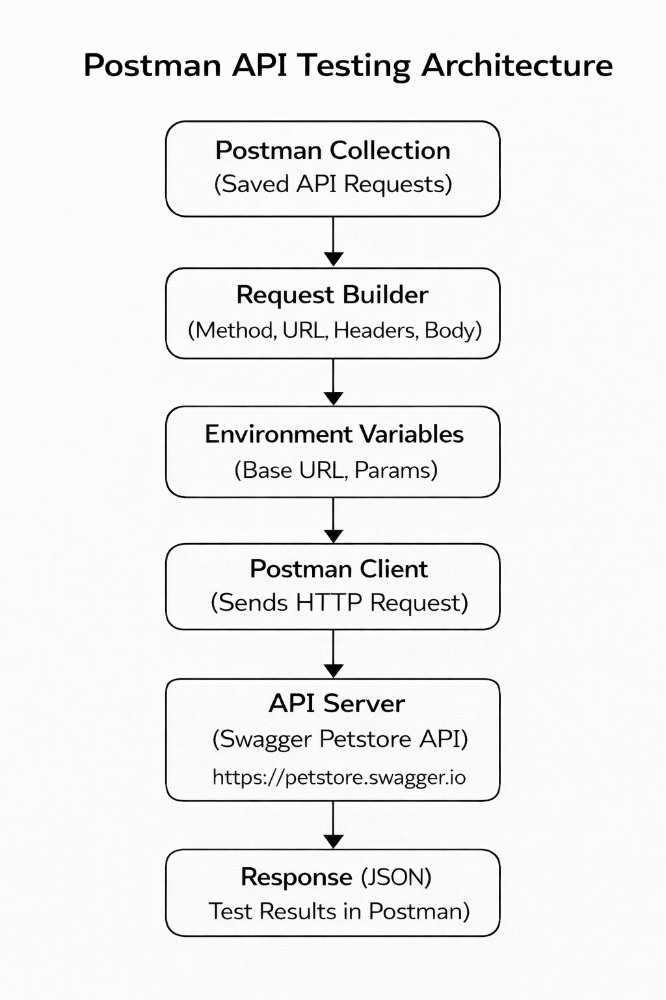

# Postman API Testing - Petstore

##  Project Overview

This repository contains API testing using Postman for the Petstore API.

It covers:

* Request creation
* Request body handling
* Status code validation
* Usage of environment variables

##  Tools Used

* Postman
* REST APIs

##  Postman Collection

The Postman collection file is available in this repository.

###  How to use:

1. Open Postman
2. Click **Import**
3. Select the collection JSON file
4. Run the requests

##  Test Cases Covered

###  Testcase 1: Simple Request & UI Navigation

* Endpoint: `GET /pet/findByStatus`
* Query Parameter: `status = available`
* Validation:

  * Verified response status code is **200**

###  Testcase 2: Request Body Handling

* Endpoint: `POST /pet`
* Sent JSON body with:

  * id
  * name
  * status
* Validation:

  * Verified response contains created pet name

###  Testcase 3: Status Code Validation

Tested different scenarios:

* Valid request → **200 OK**
* Invalid pet ID → **404 Not Found**
* Empty request body → **400 / 405 Error**

###  Testcase 4: Environment Variables

* Created environment variable:

  * "url = https://petstore.swagger.io/v2"
* Used in requests:

  * "{{url}}/pet/..."

##  What I Learned

* Creating and sending API requests
* Handling request body (JSON)
* Writing test scripts in Postman
* Validating status codes
* Using environment variables

##  Architecture Diagram

##  Author
Anshul Gunda
